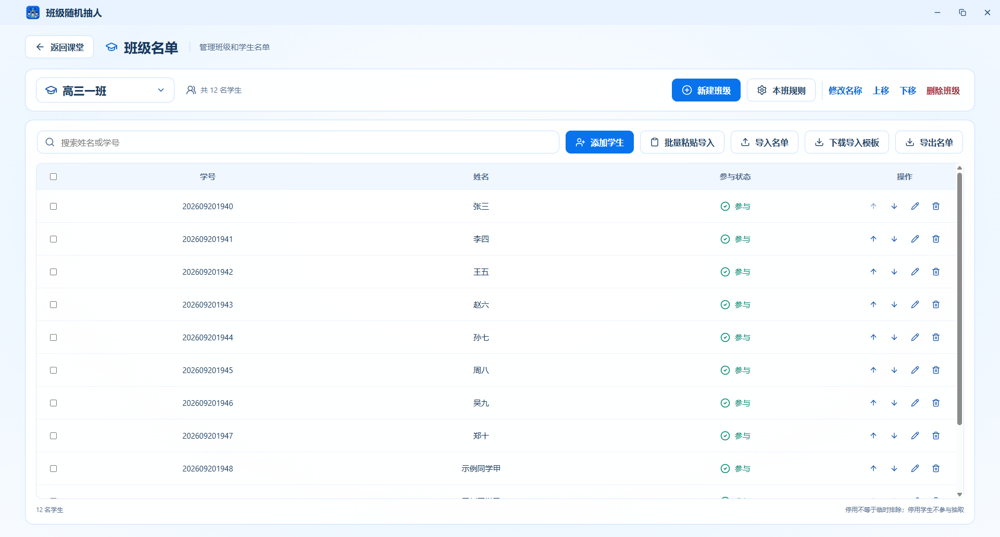
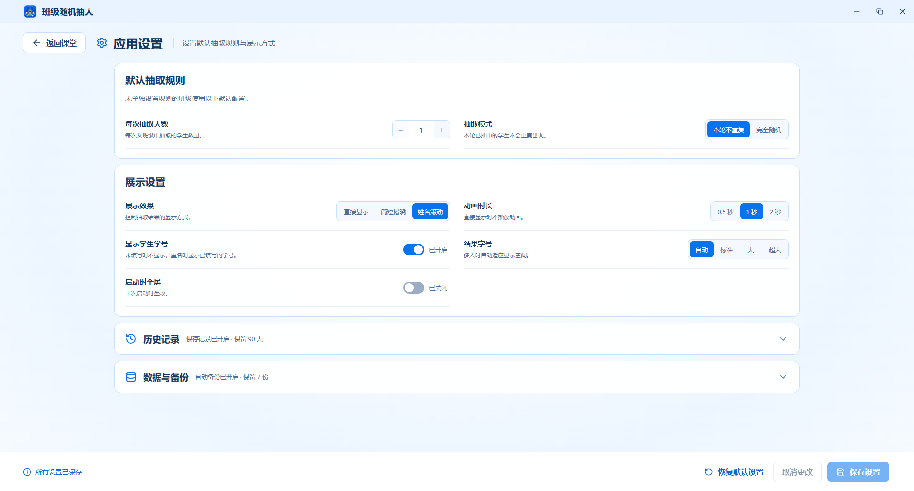
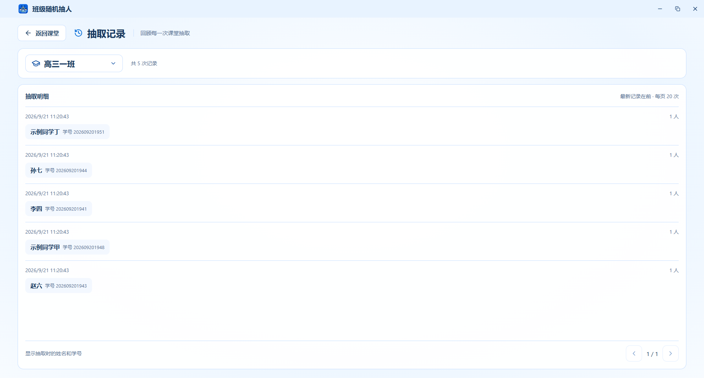

# 班级随机抽人

为课堂提问准备的轻量 Windows 桌面工具

多班级管理 · 随机点名 · 自定义规则 · 免登录 · 离线使用

[下载软件](https://github.com/ahuiyuchuan/class-picker/releases/latest) · [快速开始](#快速开始) · [界面预览](#界面预览) · [问题反馈](https://github.com/ahuiyuchuan/class-picker/issues)

## 项目介绍

班级随机抽人是一款面向教师的课堂点名工具。一位老师可以维护多个班级，导入学生名单，按课堂需要抽取一人或多人，并查看抽取进度与历史记录。

软件以单个 EXE 文件分发，无需注册或登录。名单、设置和抽取记录保存在本机，支持数据备份与恢复。

## 核心功能

| 功能 | 说明 |
| --- | --- |
| 课堂抽取 | 单人或多人随机抽取、姓名滚动等展示效果、临时排除、轮次进度与最近记录 |
| 多班级管理 | 班级切换、重命名与排序，为不同班级维护独立名单 |
| 学生名单 | 行内编辑、多行新增、批量删除、上下移动及参与状态设置；学号选填并保留前导零 |
| 名单导入导出 | 支持 XLSX、XLS、CSV 与批量粘贴导入；支持单个或多个工作表，分别配置起始行、姓名列及可选学号列；模板及导出统一为 XLSX |
| 自定义规则 | 全局设置与本班规则，按课堂需要配置抽取人数和展示方式 |
| 记录与数据 | 按班级查看抽取记录，配置历史保留，备份与恢复本机数据 |
| 课堂展示 | 自定义标题栏、最大化及全屏展示，支持键盘快捷操作 |

## 下载与运行

前往 [最新发布页面](https://github.com/ahuiyuchuan/class-picker/releases/latest)，在 **Assets** 中下载 `ClassPicker.exe`，双击即可运行。

| 下载项 | 用途 |
| --- | --- |
| `ClassPicker.exe` | Windows x64 桌面程序，普通使用者下载此文件即可 |
| `ClassPicker.exe.sha256.txt` | 用于核对 EXE 下载完整性的 SHA-256 校验文件 |
| `Source code (zip / tar.gz)` | 源码包，供开发者使用，不是可直接运行的程序 |

**运行条件：** Windows x64 和 Microsoft Edge WebView2 Runtime。程序已包含应用代码、前端资源和图标，无需安装 Python 或 Node.js；若电脑缺少 WebView2，请从 [微软官方页面](https://developer.microsoft.com/microsoft-edge/webview2/)安装运行时。

## 快速开始

1. **准备班级**：打开软件，从设置菜单进入「班级名单」，创建班级。
2. **录入学生**：直接添加学生，或点击「下载导入模板」，填写后导入；也可批量粘贴导入。
3. **设置规则**：进入「应用设置」配置默认规则，需要时为某个班级设置本班规则。
4. **开始抽取**：返回课堂，选择班级和抽取人数，点击抽取按钮。
5. **查看记录**：点击主页面的「最近记录」入口，查看该班级的历史抽取结果。

学号可以留空，软件不会自动生成。导入时勾选需要的工作表，每张表可分别设置姓名列、学号列和数据起始行；学号列默认不读取，无需输入 `0`。确认预览无误后，所选表的名单一次性导入当前班级。

预览左侧选择工作表，右侧配置并查看完整数据，每页 50 条，可翻页或输入页码。勾选多张表时，可通过「将此配置应用到其他已选表」复用列配置。发现错误后点击「查看问题」可定位到对应工作表和页码；必须处理所选表中的全部错误才能导入，分页不会改变导入范围。

文件预览的操作列支持编辑姓名、学号和移除行；保存后重新校验，移除可逐次撤销。这些操作仅影响本次导入，不修改原文件；关闭预览后丢弃。编辑期间须先保存或取消，才能切表、翻页、修改映射或确认导入。

切换姓名列或学号列时，已手动修改的字段保持不变，未修改的字段从新选列读取；手动清空的学号也会保留。

| 快捷键 | 操作 |
| --- | --- |
| `Space` | 课堂页面在可抽取状态下快捷抽取 |
| `F11` | 切换全屏 |
| `Esc` | 退出全屏 |

## 界面预览

以下管理页面为真实应用最大化截图，使用独立演示数据，不包含真实学生资料。点击图片可查看原图。

### 班级名单

维护多个班级，支持行内编辑、批量录入、导入导出和学生排序。

### 应用设置

集中配置抽取规则、展示效果及数据相关选项。

### 抽取记录

按班级查看抽取历史与结果明细。

## 数据与隐私

- **本地保存**：名单、设置和抽取记录保存在本机，无需账号。
- **数据位置**：默认目录为 `%LOCALAPPDATA%\ClassroomPicker\data`。
- **备份迁移**：更换电脑前，在应用内备份数据，再到另一台电脑恢复。
- **程序与数据独立**：复制 EXE 不会携带原电脑的名单；删除 EXE 也不会自动删除数据目录。

## 常见问题

**下载后需要安装吗？**

应用本身无需安装，双击 EXE 即可。目标电脑仍需具备 WebView2 Runtime。

**为什么下载源码包后没有 EXE？**

GitHub 的 Source code 是开发源码。请在发布页面的 Assets 中选择 `ClassPicker.exe`。

**名单可以用 Excel 导入吗？**

可以。支持 `.xlsx`、`.xls` 和 `.csv`；推荐先下载应用提供的 XLSX 模板，再按模板填写。

**表格里有公式，也能导入吗？**

可以。XLSX/XLS 读取文件已经保存的结果，不执行公式；CSV 直接读取文本。若 XLSX 的姓名或学号公式没有保存结果，预览会指出工作表及单元格，请在 WPS/Excel 中重新计算并保存后重试。不读取的列不会因公式问题阻止导入。

文本学号和 `00000` 这类纯零整数格式会保留前导零。其他数字格式使用底层值，日期/时间使用 ISO 文本，不保证完全复刻 WPS 的自定义显示格式；已保存的公式缓存也可能与重新计算后的结果不同。

**多个工作表会导入到哪里？**

全部所选工作表合并到当前班级，不会自动建班。可以单选、多选或全选，点击表名可切换预览及配置。默认只勾选第一张非空表；所选空表、字段问题和重复学号须先处理。一次合计最多 10000 人；替换模式对整批执行一次，清空本轮进度、保留历史，并先生成保护备份。

**学号没填可以参与抽取吗？**

可以。姓名必填，学号选填；空学号不会自动补号。

**复制 EXE 到其他电脑，原来的数据会一起过去吗？**

不会。请使用应用内备份与恢复功能迁移名单、设置和记录。

## 开发与贡献

项目使用 Python、Vue 3、SQLite 和 pywebview。环境安装、源码启动、单文件打包、测试命令和验证限制详见 [开发与验证指南](docs/development.md)，业务规则与接口约定详见 [实现与维护说明](docs/implementation.md)。

欢迎通过 [Issues](https://github.com/ahuiyuchuan/class-picker/issues) 反馈问题或建议。反馈时请提供软件版本、Windows 版本、复现步骤及截图，并移除真实学生姓名、学号等个人信息。提交代码前，请执行与改动相关的检查，并同步文档。

## 作者与许可

作者：**ahui**（[ahuiyuchuan](https://github.com/ahuiyuchuan)）。

本项目采用 [Apache License 2.0](LICENSE) 开源许可证。
